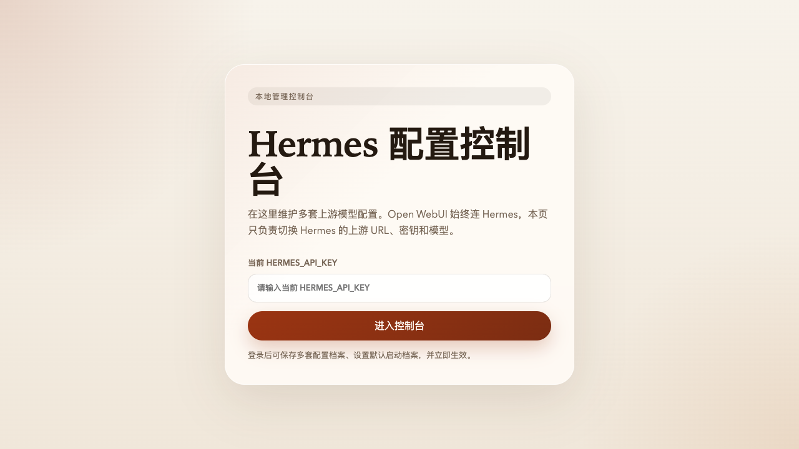
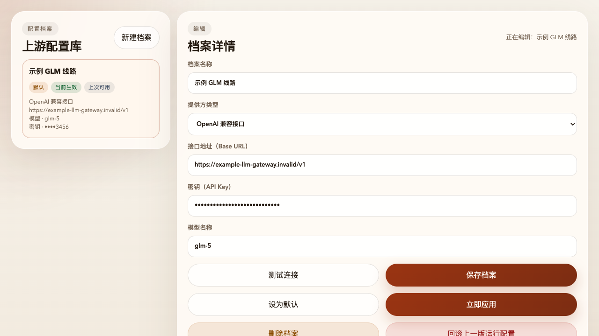

# Hermes Agent WebUI

<p align="center">
  
  
  
  
  
  
</p>

> 一个把 `Hermes Agent` 和 `Open WebUI` 打包到一起的独立部署方案。  
> **Open WebUI 始终连接 Hermes，真正的上游模型切换、默认档案管理、运行时应用和回滚都放到后台控制台完成。**

<a id="preview"></a>
## 项目预览

<table>
  <tr>
    <td width="50%" align="center"><strong>后台登录页</strong></td>
    <td width="50%" align="center"><strong>后台档案管理页</strong></td>
  </tr>
  <tr>
    <td valign="top"></td>
    <td valign="top"></td>
  </tr>
</table>

<a id="toc"></a>
## 目录

- [项目简介](#overview)
- [适合谁](#who)
- [核心亮点](#highlights)
- [工作方式](#workflow)
- [3 分钟快速开始](#quickstart)
- [后台如何登录](#login)
- [如何添加一套上游档案](#profiles)
- [为什么这个方案更适合长期用](#why)
- [项目结构](#structure)
- [常见问题](#faq)
- [公开仓库安全说明](#security)

<a id="overview"></a>
## 项目简介

这个项目解决的是一个很实际的问题：

很多人想用 `Open WebUI`，但又不希望前端直接绑定某一家模型服务商；同时还希望能在运行中切换不同上游线路、不同 `Base URL`、不同 `API Key`、不同模型名。

这个仓库把这些能力封装成了一套可直接启动的组合：

- `Hermes Agent` 作为统一的 OpenAI 兼容入口
- `Open WebUI` 作为聊天界面
- `http://localhost:18642/` 作为本地管理后台
- 多套上游配置档案管理
- 默认档案启动生效
- 一键测试上游连接
- 一键应用到运行时
- 应用失败自动回滚

简单理解就是：

**前端只管连 Hermes，Hermes 再去连你真正想用的模型服务。**

<a id="who"></a>
## 适合谁

这个项目特别适合下面几类场景：

- 想快速自建一套可用的 `Open WebUI + Hermes` 组合
- 想把 Open WebUI 和上游模型服务解耦
- 想通过后台页面切换不同模型线路，而不是反复改环境变量
- 想保留一套“默认可启动配置”，避免每次重启后手动恢复
- 想把部署文件、运行入口、后台管理能力统一放在一个仓库里

<a id="highlights"></a>
## 核心亮点

### 1. Open WebUI 永远只连 Hermes

Open WebUI 不直接面对外部模型服务，而是始终连接：

```text
http://hermes-agent:8642/v1
```

这样做的好处是：

- 前端接入关系更稳定
- 更换上游时不需要改 Open WebUI 的外部接入方式
- 你的模型服务切换逻辑集中在 Hermes 后台完成

### 2. 后台控制台可管理多套上游档案

后台地址：

- Hermes 健康检查：`http://localhost:18642/health`
- Hermes 管理后台：`http://localhost:18642/`
- Open WebUI：`http://localhost:13000`

登录后台后，你可以保存多套**配置档案**，每套档案包含：

- 档案名称
- 提供方类型
- 接口地址（`Base URL`）
- 密钥（`API Key`）
- 模型名称

并支持以下操作：

- `测试连接`
- `保存档案`
- `设为默认`
- `立即应用`
- `回滚上一版运行配置`

### 3. 改完配置可以直接生效

当你点击“立即应用”时，后台会做完整的一条链路：

1. 写入 Hermes 运行时配置
2. 同步修正 Open WebUI 使用的目标配置
3. 重启 `open-webui`
4. 等待健康检查恢复
5. 成功则标记为 `ready`
6. 失败则回滚到上一份可用运行配置

这意味着它不是“改配置文件但不生效”的控制台，而是一个真正能驱动运行时切换的后台入口。

<a id="workflow"></a>
## 工作方式

整个流转可以概括成下面这条路径：

```text
浏览器 / Open WebUI
        ↓
   Hermes Agent
        ↓
  你配置的上游模型服务
```

也就是说：

- 用户聊天发生在 Open WebUI
- Open WebUI 只请求 Hermes
- Hermes 根据当前生效档案去调用真正的上游模型

<a id="quickstart"></a>
## 3 分钟快速开始

### 1）复制环境变量

```bash
cp .env.example .env
```

然后至少设置：

```dotenv
HERMES_API_KEY=replace-with-a-long-random-password
```

注意：

这个值是**后台控制台登录口令**，不是上游模型服务的 `API Key`。

### 2）启动服务

```bash
docker compose up -d --build
```

### 3）打开页面

- 后台控制台：`http://localhost:18642/`
- Open WebUI：`http://localhost:13000`

<a id="login"></a>
## 后台如何登录

打开：`http://localhost:18642/`

登录时输入 `.env` 里的这个值：

```dotenv
HERMES_API_KEY=replace-with-a-long-random-password
```

请特别注意区分：

- 这里输入的是 `HERMES_API_KEY`
- 不是上游模型厂商给你的 `API Key`
- 不是模型名
- 不是 Open WebUI 的账号密码

<a id="profiles"></a>
## 如何添加一套上游档案

登录后台后，新增或编辑一套配置档案即可。

下面是一组**安全示例值**，只用于说明格式：

- 名称：`示例 GLM 线路`
- 提供方类型：`OpenAI 兼容接口`
- 接口地址（`Base URL`）：`https://example-llm-gateway.invalid/v1`
- 密钥（`API Key`）：`demo-api-key-not-real-123456`
- 模型名称：`glm-5`

建议操作顺序：

1. 先填写一套完整配置
2. 点击 `测试连接`
3. 测试通过后点击 `保存档案`
4. 如需默认启动，点击 `设为默认`
5. 如需立即生效，点击 `立即应用`

<a id="why"></a>
## 为什么这个方案更适合长期用

相比“让 Open WebUI 直接绑死某个模型服务”，这个方案更适合长期维护：

- **切换成本低**：换线路、换模型、换供应商都集中在后台完成
- **前端稳定**：Open WebUI 不需要频繁改接入配置
- **运维更清楚**：当前默认档案、当前生效档案、上次可用档案都能看到
- **故障更可控**：应用失败时可以回滚，不会一下把整套服务打挂

<a id="structure"></a>
## 项目结构

```text
.
├─ docker-compose.yml
├─ .env.example
├─ README.md
├─ docker/
│  └─ hermes-agent/
│     ├─ Dockerfile
│     └─ hermes-agent-src/
├─ docs/
│  └─ screenshots/
└─ data/                      # 本地运行数据，已忽略，不应提交
```

<a id="faq"></a>
## 常见问题

### 1）登录不上后台怎么办？

先确认你输入的是 `.env` 里的 `HERMES_API_KEY`。

如果刚修改过 `.env`，请重新启动 Hermes：

```bash
docker compose up -d --build hermes-agent
```

然后刷新页面再试。

### 2）Open WebUI 里为什么选不到模型？

因为 Open WebUI 前端始终只连 Hermes，真正的上游模型由后台当前生效档案决定。

请到后台确认：

- 是否已经 `测试连接` 成功
- 是否已经 `保存档案`
- 是否已经 `立即应用`
- 当前状态是否为 `ready`

### 3）为什么需要挂载 Docker Socket？

因为后台在“立即应用”时，需要能够：

- 重启 `open-webui`
- 等待它恢复健康
- 失败时回滚运行配置

所以 `hermes-agent` 容器需要访问 Docker 控制能力。

### 4）如何停止整套服务？

```bash
docker compose down
```

<a id="security"></a>
## 公开仓库安全说明

这个仓库默认**不应提交**以下内容：

- 根目录 `.env`
- `data/` 下的运行时数据
- 本地数据库、日志、快照文件
- 本地虚拟环境目录

如果你准备把仓库公开，请确保：

- 所有真实密钥只保留在本地 `.env`
- README 里的地址、口令、密钥都使用示例值
- 运行数据目录不要进入 Git

## 致谢

- `Hermes Agent`
- `Open WebUI`

如果你想要一个**前端固定、上游可切换、支持后台管理且改完就能生效**的本地部署版本，这个仓库就是为这个目标准备的。
